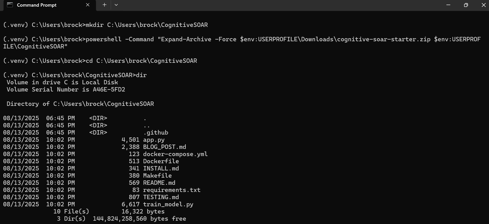
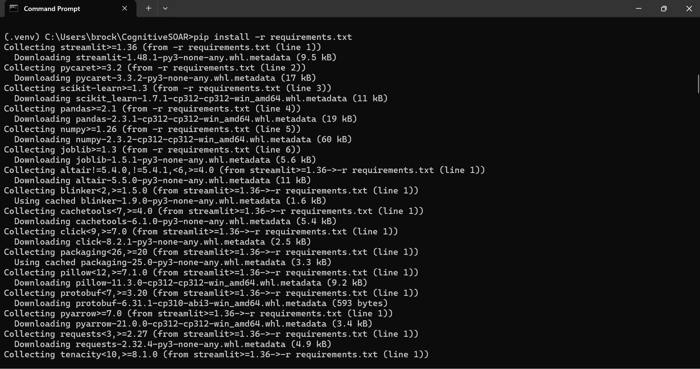
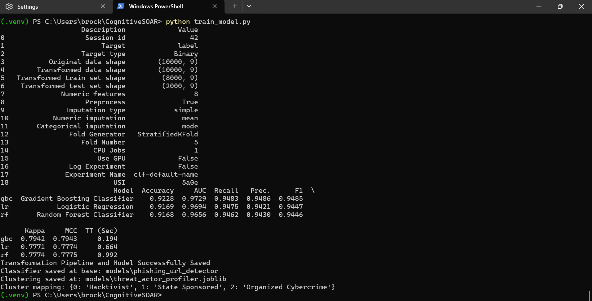
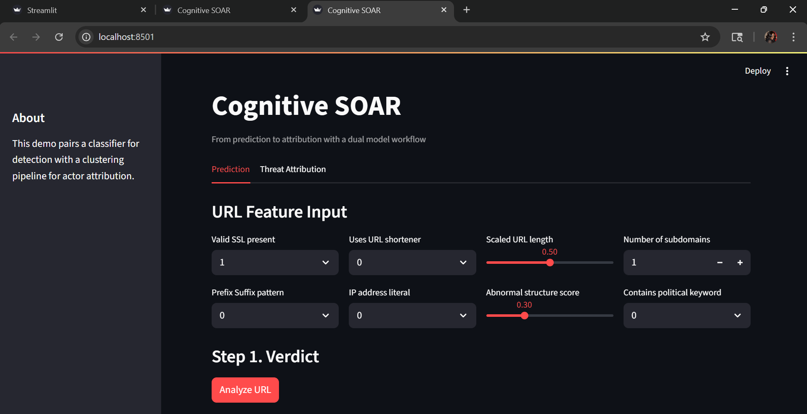
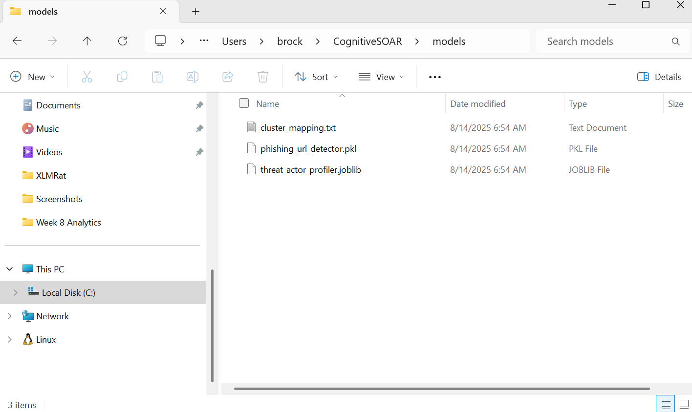

# Cognitive SOAR: From Prediction to Attribution

**Published at:** `blogs.gwu.edu/brock_lr`

**Excerpt**  
This project extends a Uniform Resource Locator (URL) triage application from basic detection to meaningful attribution. A supervised model decides malicious or benign. When the sample is malicious, an unsupervised step assigns a behavior profile that supports faster triage and clearer response in a Security Operations Center (SOC) (Lecture 11, n.d.).

## Introduction

Binary alerts reduce noise but do not direct action. A verdict that says malicious or benign leaves critical questions unanswered. In a Security Operations Center, the next question is who the activity resembles and what that implies for response tempo, containment choices, and communication paths. Adding an attribution step at the point of triage supplies that context and shortens the path from a signal to an initial decision (Lecture 11, n.d.).

Cognitive Security Orchestration, Automation, and Response turns this idea into a simple flow. The application first renders a supervised decision on malicious or benign. If and only if the outcome is malicious, the same feature set flows into an unsupervised model that groups the case into one of three behavior profiles. The three profiles are Organized Cybercrime, Hacktivist, and State Sponsored. The intent is not to name a specific group. The intent is to present a clear and defensible label that guides the first move and improves the handoff between teams (Lecture 11, n.d.).

## Methodology

**Feature design.** The dataset focuses on a small set of URL features that analysts recognize during triage. The features include the presence of a valid Secure Sockets Layer (SSL) certificate, an indicator for prefix or suffix tricks in the domain, the use of a URL shortener, the use of an Internet Protocol (IP) address literal instead of a hostname, an indicator for political language, a scaled length measure, a count of subdomains, and a simple irregularity score. These signals support both a clean malicious versus benign decision and a second pass that distinguishes behavior styles in a way that maps to common response playbooks (Lecture 11, n.d.).

**Profile shaping.** The malicious class is expressed as three styles so the clustering step can discover meaningful structure. Organized Cybercrime leans toward high volume activity with noisy structure and more frequent use of shorteners and IP address literals. Hacktivist activity is opportunistic and message driven and can include political terms with moderate structural changes. State Sponsored activity tends to present as cleaner on the surface, often with valid SSL, fewer shorteners and IP address literals, and subtle structure changes. A conservative benign class sits apart with stable values so the classifier learns a clear boundary (Lecture 11, n.d.).

**Algorithm choice.** The attribution step uses K Means clustering. The synthetic generator intentionally creates three compact and roughly balanced groups, which aligns with the objective of K Means to minimize within cluster variance around centers. This method is efficient and easy to explain, which matters in triage where decisions must be fast and defensible. When data shapes change, alternatives can be considered. Density Based Spatial Clustering of Applications with Noise is appropriate when there is irregular structure with true noise. A Gaussian Mixture Model is suitable when clusters overlap with different variances. For the present design, K Means provides the most direct fit. The clustering model is implemented as a scikit learn pipeline that standardizes features before the clustering step so that no single measurement dominates the centers (Pedregosa et al., 2011).

**Training workflows.** Detection and attribution follow independent workflows to preserve clarity and reproducibility. The supervised path trains a binary classifier on the full dataset using the PyCaret classification workflow during training, then exports a plain scikit learn estimator for inference so the runtime image remains small (Ali, 2020). The unsupervised path filters to malicious rows and fits the scikit learn pipeline with standardization and K Means, using multiple random starts to stabilize the solution. After fitting, centers are inspected on anchor features and each numeric cluster identifier is assigned a stable human label. That mapping is written to a small text file so the application can display a consistent profile name across runs. This separation mirrors the course guidance that supervised and unsupervised work should never share a single setup and should be saved as distinct artifacts (Lecture 11, n.d.).

**Application flow.** The Streamlit interface loads both artifacts once and keeps them in memory as shared resources so interaction remains responsive. The operator enters feature values and requests analysis. The classifier returns a verdict with a confidence score. If the verdict is benign, the analysis ends and the attribution view remains hidden to avoid distracting information. If the verdict is malicious, the same feature vector flows into the clustering pipeline, which returns a cluster identifier that is mapped to a profile name. The Threat Attribution tab then presents the profile and a short explanation in plain language that ties back to the defining signals. This presentation pattern follows the course emphasis on simple tabs, cached assets, and clear outputs for operational tools (Streamlit, n.d.; Lecture 11, n.d.).

**Packaging and artifacts.** The repository documents the goal, the two model architecture, and the steps to install and test. Training can run locally with the full stack. Inference runs in a compact container that includes Streamlit, pandas, numpy, joblib, and scikit learn. The application loads a plain scikit learn classifier and the clustering pipeline at runtime, and it reads the text mapping that binds cluster identifiers to profile names. This packaging approach reflects the class guidance on reproducible environments, clear artifact names, and a README that serves as a roadmap for reviewers (Lecture 11, n.d.).

## Setup and training figures

**Project folder (`figures/Set01_Env_01_Project_Folder - 1.png`).**  
Repository after clone with `app.py`, `train_model.py`, the `models` directory, and documentation in place. The structure matches the expected layout before installation.

**Virtual environment active (`figures/Set01_Env_02_Venv_Activated - 2.png`).**  
An isolated Python environment is active. This confirms that installation will not depend on system packages or leak dependencies.

**Install start (`figures/Set02_Install_01_Pip_Started - 3.png`).**  
Dependency installation begins from `requirements.txt`. This verifies the runtime set required for inference.

**Install complete (`figures/Set02_Install_01_Pip_Complete - 4.png`).**  
All packages install without errors. The environment is ready for training and inference.

**Models saved (`figures/Set02_Train_02_Models_Saved - 4.png`).**  
Training completes and artifacts are written to `models`. This confirms that both detection and attribution pipelines persist correctly.

**Models finalized (`figures/Set02_Train_02_Models_Solidified - 5.png`).**  
The console shows final save paths and a printed cluster mapping. The mapping is human readable and stable across runs.

**App home (`figures/Set03_App_01_Home - 6.png`).**  
The Streamlit interface loads with a two tab layout. This confirms that models can be loaded and the page responds as expected (Streamlit, n.d.).

**Models folder map (`figures/Set05_Map_00_Models_Folder - 18.png`).**  
A directory view of the `models` folder. This verifies the presence and names of all artifacts used at runtime.

## Model artifacts — what each file is for

These artifacts support a clean separation between detection and attribution. Each file has a single purpose and a stable name so the runtime can load it without confusion (Lecture 11, n.d.).

- **`models/phishing_url_detector.pkl`.** This is the PyCaret formatted classifier saved during training. It is useful for local experiments that rely on PyCaret utilities, such as quick comparisons or calibration checks (Ali, 2020). The production application does not need this file for inference.

- **`models/phishing_url_detector_sklearn.joblib`.** This is the plain scikit learn classifier that the application loads at runtime. It removes training time dependencies and keeps the container small, while preserving the exact decision boundary learned during training (Pedregosa et al., 2011).

- **`models/threat_actor_profiler.joblib`.** This is the attribution pipeline. It contains a StandardScaler followed by K Means with three clusters. It runs only after a malicious verdict and produces the numeric cluster identifier that the interface maps to a profile name (Pedregosa et al., 2011).

- **`models/cluster_mapping.txt`.** This is the human readable map from numeric cluster identifier to profile name. It stabilizes the label shown in the interface so the wording remains consistent across retrains. The mapping exists outside the model file to make review and change control straightforward during grading and future updates (Lecture 11, n.d.).

## Results and discussion

Testing covered one benign case and three malicious cases that align with the three profiles. Each case was run through the application with screenshots that show inputs, the verdict, and the attribution view. The results match the training design and support the claim that a short profile next to the verdict speeds early decision making in a Security Operations Center (Lecture 11, n.d.).

**Benign case.** The input used valid SSL, no shortener, no IP literal, and a low irregularity score. The classifier returned Benign. The attribution tab remained hidden, which prevents unnecessary information from entering the analyst view. The pair of screenshots shows the inputs and the result in sequence (`Set04_Tests_01_Benign_Inputs - 7.png`, `Set04_Tests_02_Benign_Results - 8.png`).

**Organized Cybercrime case.** The input enabled the shortener flag and the IP literal flag and raised the structural irregularity. The classifier returned Malicious at high confidence. The attribution tab labeled the case as Organized Cybercrime, which is consistent with a noisy and high volume pattern. The sequence appears as inputs, result, and attribution view (`Set04_Tests_03_Crime_Inputs - 9.png`, `Set04_Tests_04_Crime_Result - 10.png`, `Set04_Tests_04b_Crime_Attribution - 11.png`).

**Hacktivist case.** The input introduced political language and kept structural change moderate. The classifier returned Malicious. The attribution tab labeled the case as Hacktivist. This fit the opportunistic and message driven style encoded during data generation. The screenshots show inputs, result, and attribution view (`Set04_Tests_05_Hacktivist_Inputs - 12.png`, `Set04_Tests_06_Hacktivist_Result - 13.png`, `Set04_Tests_06b_Hacktivist_Attribution - 14.png`).

**State Sponsored case.** The input used valid SSL, no shortener, and no IP literal, with a cleaner structure and a small prefix or suffix signal. The classifier returned Malicious. The attribution tab labeled the case as State Sponsored. The mapping aligns with the intent to simulate patient and better resourced activity. The sequence is visible in inputs, result, and attribution view (`Set04_Tests_07_State_Inputs - 15.png`, `Set04_Tests_08_State_Result - 16.png`, `Set04_Tests_08b_State_Attribution - 17.png`).

The practical effect is a shorter path from a signal to an initial decision. The analyst sees a verdict and a plain profile in the same view. That combination focuses attention during the first minutes of triage and supports a cleaner handoff to incident management because the profile communicates expected behavior in a few words (Lecture 11, n.d.; Streamlit, n.d.).

**What this adds for an analyst**  
- **Speed.** The verdict and the profile appear together. The first move is clear.  
- **Clarity.** The label points to a response path and a playbook.  
- **Transparency.** The application shows the numeric cluster identifier and uses a fixed mapping, which makes the outcome easy to audit.

**Operational interpretation of each profile**  
- **Organized Cybercrime.** Prioritize rate limits, bot rules, and fraud controls on likely targets.  
- **Hacktivist.** Expect bursts around news events. Emphasize short communications and social context checks.  
- **State Sponsored.** Hunt for stealth and dwell time. Contain carefully and preserve evidence for follow up analysis.

An internal validity check supports the attribution behavior. The clustering pipeline standardizes inputs and fits K Means with multiple starts, which stabilizes centers and reduces the chance that a single random initialization will shape the outcome (Pedregosa et al., 2011). The human readable mapping file fixes the text labels that the interface presents, so the same numeric cluster will render the same profile across repeated runs and during grading (Lecture 11, n.d.).

There are limits that matter in practice. The profile is a behavior label and not an identity claim. The synthetic dataset is designed to be separable, while real telemetry can be irregular and noisy. If shapes change, the clustering method may need to change with them. If software versions change, the artifacts should be rebuilt to avoid compatibility issues (Pedregosa et al., 2011). These cautions keep the enrichment step grounded in operational reality while still delivering a useful improvement to triage.

## Limitations and risks

Attribution in this system is behavioral context. It is not an identity claim. The label guides the first move and does not prove who is behind an event (Lecture 11, n.d.).

The synthetic dataset is designed to be separable. Real telemetry can be irregular and noisy. Patterns may drift over time as attackers change tactics. When shapes change, the clustering method may need to change with them. Density based approaches can help when there is true noise. Mixture models can help when clusters overlap with different variances (Pedregosa et al., 2011).

Serialized models depend on specific library versions. Uncontrolled upgrades can break compatibility. Version pinning and regular rebuilds reduce this risk and keep the workflow reproducible from training through grading and deployment (Lecture 11, n.d.; Pedregosa et al., 2011).

The user interface hides attribution when the verdict is benign. This reduces distraction during triage. It also creates a dependency on the detection threshold. If the threshold is set too aggressively, some malicious cases may not reach the attribution step. Threshold review and simple calibration checks support balanced behavior over time (Lecture 11, n.d.).

Operational use demands auditability. The system prints the numeric cluster identifier and uses a fixed text mapping. This makes outcomes easy to review and discuss during after action analysis. It also creates a small governance task to update the mapping when retraining changes cluster geometry. A dated mapping file with short notes addresses that task in a simple way (Lecture 11, n.d.).

## Future work

Several extensions would improve confidence and keep the workflow grounded in operational reality. The first area is **feature depth**. Adding domain age, certificate age, simple hosting indicators, and short time window counts would provide context that does not depend on content scraping. These features are inexpensive to compute and tend to be stable across environments. They would help both the detection boundary and the attribution geometry by anchoring behavior in time and basic infrastructure signals (Lecture 11, n.d.).

A second area is **modeling and validation**. The current attribution uses K Means, which fits compact and balanced shapes. As new telemetry arrives, periodic checks should measure cluster stability and separation. If shapes begin to overlap or show irregular structure, Density Based Spatial Clustering of Applications with Noise and Gaussian Mixture Models are natural alternatives. A small calibration pass for the classifier, such as Platt scaling or isotonic regression, would also support threshold selection and confidence reporting in a way that is easier to audit over time (Pedregosa et al., 2011).

The **user interface** can explain more with very little text. A short panel that lists the top two or three features closest to the selected center would make the attribution easier to trust during a live call. The interface already hides attribution when the verdict is benign. It can also show the numeric cluster identifier and a one sentence rationale for each profile so the analyst sees both the label and the reason at a glance (Streamlit, n.d.; Lecture 11, n.d.).

Operational work benefits from **feedback loops**. A simple thumbs up or thumbs down on the profile would capture analyst judgment without slowing the flow. Those labels can seed a supervised multi class model later. That model could learn directly from local data while the clustering pipeline remains available as a reference baseline. A small governance step would keep the `cluster_mapping.txt` file dated and versioned so changes in wording remain visible during reviews (Lecture 11, n.d.).

Finally, **runbook integration** turns attribution into action. Each profile should link to short, concrete steps that match expected behavior. Organized Cybercrime maps to rate limits, bot rules, and fraud checks. Hacktivist maps to concise communications and monitoring for bursts around news. State Sponsored maps to careful containment and deeper hunting for stealth and dwell time. Aligning these steps to a common framework such as MITRE ATT&CK strengthens shared language across teams and supports after action analysis (MITRE, n.d.).

## Conclusion

The upgrade moves a simple detector into a practical triage surface. A supervised model decides malicious or benign. An unsupervised model assigns a likely behavior profile when the sample is malicious. The interface presents both outcomes in one place. This pairing turns a signal into a clear first step for a Security Operations Center. The analyst gains speed, direction, and a common language for the handoff. The approach remains transparent because the pipeline is small, the artifacts are named, and the mapping from cluster identifier to profile is plain and stable (Lecture 11, n.d.).

The method is also honest about limits. Profiles describe behavior and do not claim identity. Synthetic data is meant to be separable, while production data can be messy. Shapes can drift and versions can drift. These facts do not reduce the value of the tool. They define the work needed to keep it reliable. With version pinning, periodic checks, and simple governance for mapping updates, the system stays useful and easy to grade. It also sets a clear path for future additions such as richer features, light calibration, and direct ties to playbooks (Pedregosa et al., 2011; MITRE, n.d.; Streamlit, n.d.).

## References

Ali, M. (2020). *PyCaret: An open source low code machine learning library in Python*. PyCaret. https://pycaret.org

Lecture 11. (n.d.). *Building a Mini SOAR: Packaging, orchestration, and UI patterns* [Course lecture slides]. George Washington University.

MITRE. (n.d.). *ATT&CK for Enterprise*. https://attack.mitre.org/

Pedregosa, F., Varoquaux, G., Gramfort, A., Michel, V., Thirion, B., Grisel, O., Blondel, M., Prettenhofer, P., Weiss, R., Dubourg, V., Vanderplas, J., Passos, A., Cournapeau, D., Brucher, M., Perrot, M., & Duchesnay, É. (2011). Scikit learn: Machine learning in Python. *Journal of Machine Learning Research, 12*, 2825–2830. https://jmlr.org/papers/v12/pedregosa11a.html

Streamlit. (n.d.). *Cache resources*. Streamlit Docs. https://docs.streamlit.io/develop/api-reference/caching-and-state/st.cache_resource
<<<<<<< HEAD

=======
>>>>>>> b9779d8 (Update BLOG_POST, Dockerfile, README; add live app screenshot)
